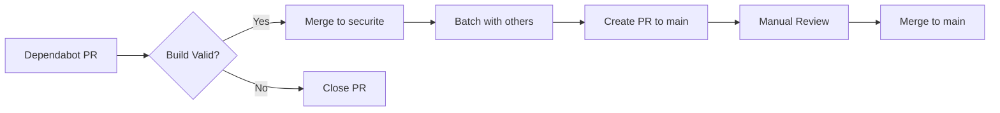

# Dependabot Secure Flow

> Automated dependency management with security-first batch processing

[](https://github.com/marketplace/actions/dependabotsecureflow)
[](https://opensource.org/licenses/MIT)

## 🎯 Overview

**Dependabot Secure Flow** is a GitHub Action that automatically manages dependency updates through a secure, batched workflow. Instead of merging Dependabot PRs directly to `main`, this action:

1. ✅ Auto-merges Dependabot PRs into a `securite` branch
2. 🧪 Validates builds and tests
3. 📦 Batches multiple updates together
4. 📝 Auto-generates changelog entries
5. 🚀 Creates a single PR to `main` for review

## 🚀 Features

- **Security-First**: All updates are validated before reaching `main`
- **Batch Processing**: Multiple dependency updates are grouped together
- **Auto-Correction**: Failed builds automatically close problematic PRs
- **Changelog Automation**: Automatic timestamp and changelog updates
- **Zero Configuration**: Works out of the box with sensible defaults

## 📦 Installation

### 1. Add the workflow to your repository

Create `.github/workflows/dependabot-secure-flow.yml`:

```yaml
name: Dependabot Secure Flow

on:
  pull_request:
    types: [opened, synchronize]
    paths:
      - 'package.json'
      - 'package-lock.json'
  workflow_dispatch:

permissions:
  contents: write
  pull-requests: write
  issues: write

jobs:
  auto-merge-to-securite:
    uses: EthanThePhoenix38/dependabot-secure-flow/.github/workflows/dependabot-secure-flow.yml@main
    secrets: inherit
```

### 2. Configure Dependabot

Create `.github/dependabot.yml`:

```yaml
version: 2
updates:
  - package-ecosystem: "npm"
    directory: "/"
    schedule:
      interval: "daily"
    open-pull-requests-limit: 10
```

### 3. Add required scripts to `package.json`

```json
{
  "scripts": {
    "build": "echo 'Build step' && exit 0",
    "test": "echo 'Test step' && exit 0"
  }
}
```

## 🔧 How It Works



1. **Dependabot creates a PR** with dependency updates
2. **Workflow validates** the build (`npm install && npm run build`)
3. **Auto-merge to `securite`** if validation passes
4. **Close PR** if validation fails (with label `skipped-vulnerability`)
5. **Batch updates** accumulate in the `securite` branch
6. **Create PR to `main`** for final review
7. **Update documentation** (README timestamp, CHANGELOG)

## 📋 Requirements

- Node.js project with `package.json`
- `npm run build` script (can be a no-op: `echo 'No build'`)
- GitHub repository with Dependabot enabled

## ⚙️ Configuration

### Optional: Customize the workflow

You can override default behavior by modifying the workflow file:

```yaml
jobs:
  check-interdependencies:
    steps:
      - name: Auto-Correction & Validation
        run: |
          npm install --prefer-offline --no-audit
          npm run build
          npm test  # Add your test command
```

### Branch Strategy

- `main`: Production-ready code
- `securite`: Staging area for dependency updates
- `dependabot/*`: Temporary branches (auto-deleted after merge)

## 🛡️ Security

This action follows security best practices:

- ✅ No external dependencies (uses only GitHub Actions)
- ✅ Validates all updates before merging
- ✅ Auto-closes PRs that fail validation
- ✅ Requires manual review before reaching `main`

## 📊 Example Output

When the workflow runs successfully:

```
✅ Merged into securite branch for batch processing.
📝 Updated CHANGELOG.md with timestamp
🎉 Created PR #42: chore: dependency updates batch
```

## 🤝 Contributing

Contributions are welcome! This action is maintained in the [AI-Pulse](https://github.com/ThePhoenixAgency/AI-Pulse) repository and automatically synced here.

## 📄 License

MIT License - see [LICENSE](LICENSE) for details

## 🔗 Links

- [GitHub Marketplace](https://github.com/marketplace/actions/dependabotsecureflow)
- [Source Repository](https://github.com/EthanThePhoenix38/dependabot-secure-flow)
- [Issue Tracker](https://github.com/EthanThePhoenix38/dependabot-secure-flow/issues)

---

**Made with ❤️ by [ThePhoenixAgency](https://github.com/ThePhoenixAgency)**
